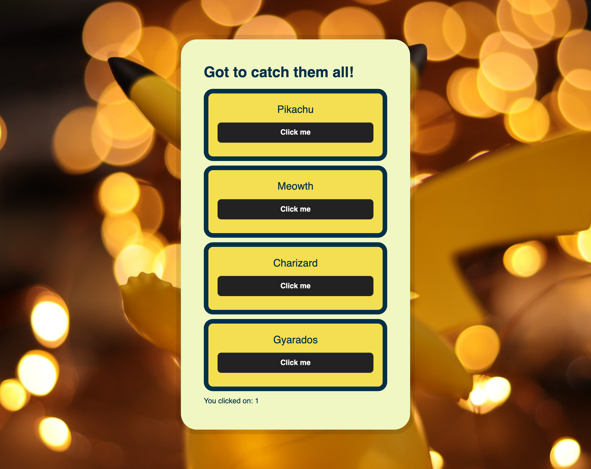

# Tutorial 10

**Course Title**: Web Development

**Course Code**: IRM1005 / ITEC1005

**Semester**: Fall 2023

**Due Date**: n/a

**Assessment**: n/a

## TLDR

1. Working with JavaScript and the DOM.
2. You will just be updating the `script-XX.js` files for this tutorial exercise (instructions provided inside each file).
3. Modify your files, and commit the changes back to your repo.
4. Turn on GitHub Pages.
5. If you would like feedback or help submit a comment in the [Tutorial - Show and Tell discussion](https://github.com/orgs/irm1005-itec1005-fall-2023/discussions/16) and share a link to your index page.

## Table of contents

- [Final Solution Screenshots]()
- [Description](#description)
- [Instructions](#instructions)
- [Additional Help](#additional-help)
- [Helpful Links](#📚-helpful-links)

## Screenshots

### Step 02

### Step 03

### Step 04

## Description

The goal of this tutorial is for students to gain some experience writing JavaScript and using the DOM to manipulate elements on a web page.

## Instructions

Completing this challenge should be pretty easy. If you get stuck refer to the lecture notes and lecture demo code for help. The instructions below assume you have a working developer environment.

To complete this tutorial you must follow the steps below. Additional help can be found further below.

- There are four files that you are going to modify in this exercise, `script-XX.js`.
- Instructions on what code to write are provided in each file.
- If you get stuck, you can use the example in the `solutions` folder for guidance.
- Preview your pages using the LivePreview or LiveServer extentions in VSCode to ensure you have the correct output.
- Commit your changes and push to GitHub.
- Turn on [GitHub Pages](https://github.com/orgs/irm1005-itec1005-fall-2023/discussions/4) in the `settings` section of your repository.
- View your live web pages.
- In the [Tutorial - Show and Tell discussion](https://github.com/orgs/irm1005-itec1005-fall-2023/discussions/16) in our GitHub Discussion Group, add a comment with a link to your pages.
- Check out some of your other team members work and make sure to tell them how awesome they are.

## Additional help

### Cloning your tutorial repository

Refer to the Birghtspace videos `Setting up all the things` for instructions on how to setup your local development environment and clone your tutorial repository so that you can work on your code locally.

### Activating GitHub pages

Refer to this [discussion post](https://github.com/orgs/irm1005-itec1005-fall-2023/discussions/4) for instructions on how to turn on the GitHub Pages service for your repository.

## 📚 Helpful links

### JavaScript

- [MDN JS Docs](https://developer.mozilla.org/en-US/docs/Web/JavaScript)
- [MDN JS Guide](https://developer.mozilla.org/en-US/docs/Web/JavaScript/Guide)
- [Arrays](https://developer.mozilla.org/en-US/docs/Web/JavaScript/Reference/Global_Objects/Array)

### GitHub

- [A short video explaining what GitHub is](https://www.youtube.com/watch?v=w3jLJU7DT5E&feature=youtu.be)
- [Git and GitHub learning resources](https://docs.github.com/en/github/getting-started-with-github/git-and-github-learning-resources)
- [Understanding the GitHub flow](https://guides.github.com/introduction/flow/)
- [How to use GitHub branches](https://www.youtube.com/watch?v=H5GJfcp3p4Q&feature=youtu.be)
- [GitHub's Learning Lab](https://lab.github.com/)
- [Education community forum](https://education.github.community/)
- [GitHub community forum](https://github.community/)

### Git

- [Interactive Git training materials](https://githubtraining.github.io/training-manual/#/01_getting_ready_for_class)
